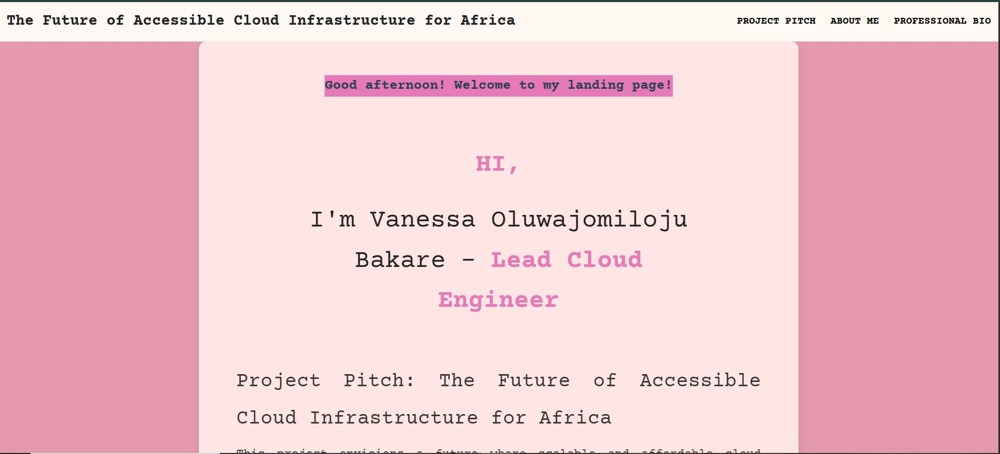
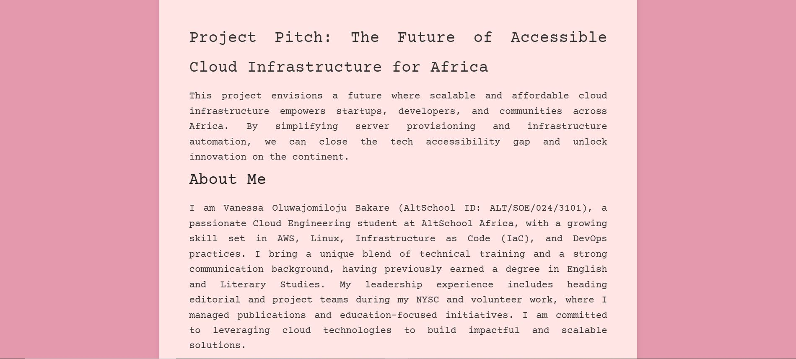
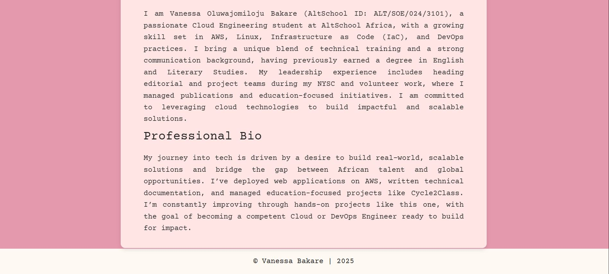
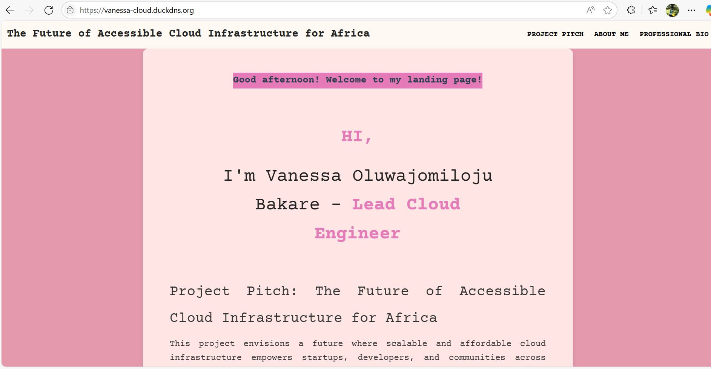

# Vanessa Bakare | Lead Cloud Engineer| Cloud Engineering Project

**Author:** Vanessa Oluwajomiloju Bakare   
**Project Title:** The Future of Accessible Cloud Infrastructure for Africa  
**Description:** This is a dynamic landing page designed to demonstrate my skills in cloud engineering, web development, and server deployment using AWS EC2 and Nginx. It features a personalized, responsive layout that highlights my expertise in setting up cloud infrastructure, configuring web servers, and deploying web applications.

## My IP Address
Public IP Address: 16.170.250.170  
Domain Name: vanessa-cloud.duckdns.org

## Screenshots Of The Rendered Website




## Step-by-Step Documentation  
### AWS EC2 Instance
- I began by logging into and opening my AWS Management Console and navigated to the EC2 section
- I then launched an EC2 Instance in AWS using Ubuntu Server and also created a key pair to enable remote ssh

### WSL Terminal
- To SSH into my EC2 instance from WSL, I needed to use the .pem private key file that was downloaded to my Windows Downloads folder.
- To copy the key pair file in Windows Downloads folder into my WSL home directory, I used this command:
```
cp /mnt/c/Users/USER/Downloads/key.pem ~/.ssh/
```
- After copying, I changed the file permissions so SSH would accept the key using this command:
```
chmod 600 ~/key.pem
```
- Then i connected to my EC2 instance using this command:
```
ssh -i ~/.ssh/key.pem ubuntu@16.170.250.170
```

### Configuring Networking
- Next, I configured the Security Group of my instance by navigating to "Security Groups" to ensure Inbound Rules allow: - SSH (port 22) from my IP and HTTP (port 80) from anywhere (0.0.0.0/0) and to also allow HTTPS (Port 443)
  

### Installing Nginx
- Before installing Nginx, I first updated my package repositories using these commands: 
```bash
sudo apt update
sudo apt upgrade -y
```
- Next I used this command to install Nginx :
```
sudo apt install nginx -y
```
- Next I started and enabled the Nginx service :
```
sudo systemctl start nginx
sudo systemctl enable nginx
```

### Creating and Deploying the HTML Landing Page
- After navigating to the right directory, I used the command below to create my .html file for my landing page:
```
sudo nano /var/www/html/index.html
```
- Next, I added my simple HTML content and saved the file. This is the content i put in my index.html file:
  
  1. Project Pitch
  ```
  This project envisions a future where scalable and affordable cloud infrastructure empowers startups, developers, and communities across Africa. By simplifying server provisioning and infrastructure automation, we can close the tech accessibility gap and unlock innovation on the continent.
  ```
  2. About Me
  ```
  I am Vanessa Oluwajomiloju Bakare (AltSchool ID: ALT/SOE/024/3101), a passionate Cloud Engineering student at AltSchool Africa, with a growing skill set in AWS, Linux, Infrastructure as Code (IaC), and DevOps practices. I bring a unique blend of technical training and a strong communication background, having previously earned a degree in English and Literary Studies. My leadership experience includes heading editorial and project teams during my NYSC and volunteer work, where I managed publications and education-focused initiatives. I am committed to leveraging cloud technologies to build impactful and scalable solutions.
  ```
  3. Professional Bio
  ```
  My journey into tech is driven by a desire to build real-world, scalable solutions and bridge the gap between African talent and global opportunities. I’ve deployed web applications on AWS, written technical documentation, and managed education-focused projects like Cycle2Class. I’m constantly improving through hands-on projects like this one, with the goal of becoming a competent Cloud or DevOps Engineer ready to build for impact.
  ```
  
- Then I created my CSS file for stylying the HTML using this command :
```
sudo nano /var/www/html/style.css
```
- I went back to my home directory and created a new folder which i called "altSchoolExam"
- Then i used the commands below to copy my index.html and style.css files into this new directory for backup- "altSchoolExam" :
```
cp /var/www/html/index.html ~/altSchoolExam/
cp /var/www/html/style.css ~/altSchoolExam/
```
- I took screenshots of my rendered website and copied them from my Windows Downloads folder to my working directory by using the following steps:
  1. I first navigated to my screenshots folder using `cd /mnt/c/Users/USER/Downloads/ALTProject2`
  2. Then after i set the right permissions, I used this command to copy the the screenshots to my home directory`scp -i ~/key.pem screenshot1.JPG ubuntu@16.170.250.170:~`
  3. Then i copied the screenshots from my home directory to the folder i wanted to initialize Git in.

  
### GitHub 
- I initialized Git in my working directory (altSchoolExam) using `git init`
- I staged the index.html and style.css files using `git add .`
- Then I commited the file and added a message using `git commit -m "My commit message"`
- Then opened my Github in my browser and created a new repo for this project.
- Then i navigated to Security/tokens, to create a PAT to use for pushing to my remote repo
- Then i used the following commands"
  ```
  git remote add origin https://github.com/Vanessabakare/RepoName.git
  git branch -M main
  git push -u origin main
  ```
- Then i entered the PAT i had created earlier.


### Creating My README Doc
- Then i went on to create my README doc and I included all the required info and files.

### Bonus Task-  Secure with Let’s Encrypt SSL (Certbot)
- Last minute i decided to try my hands at securing with Let's Encrypt. So i began by first setting up my domain name.
- I found out about DuckDNS, so i created a subdomain: `vanessa-cloud.duckdns.org`.
- Once it was successfully created, I updated the DuckDNS record to point to my EC2 public IP: `16.170.250.170`.

### Update Nginx Configuration
- Because of this changes i made, i navigated into my Nginx configuration folder to correct the SSL certificate paths
- I set the `server_name` to `vanessa-cloud.duckdns.org`.
- Next, i configured the HTTP server block to redirect all HTTP traffic to HTTPS:
       ```
       server {
           listen 80;
           listen [::]:80;
           server_name vanessa-cloud.duckdns.org;
           return 301 https://$host$request_uri;
       }
       ```
###Installed Certbot and Generated the SSL Certificate
- The next thing i did was install the Certbot and  Nginx plugin, using the command below:
     ```
     sudo apt install certbot python3-certbot-nginx -y
     ```
- Then i ran Certbot with the Nginx plugin using this command below:
     ```
     sudo certbot --nginx -d vanessa-cloud.duckdns.org
     ```
- Finally, i followed the prompts to:
     - Enter my email address: 
     - Agree to the terms of service.
     - And to also let Certbot automatically configure HTTPS on Nginx.
- Next, i verified that the site was accessible via:
     ```
     https://vanessa-cloud.duckdns.org
     ```
- The screenshot below shows that my site successfully deployed and is now served securely via HTTPS.
- )
